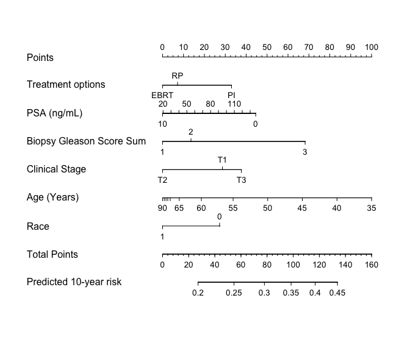

<!-- README.md is generated from README.Rmd. Please edit that file -->

# QHScrnomo 

<!-- badges: start -->

[](https://lifecycle.r-lib.org/articles/stages.html#stable)
[](https://CRAN.R-project.org/package=QHScrnomo)

<!-- badges: end -->

[Nomograms](https://en.wikipedia.org/wiki/Nomogram) serve as practical,
useful tools and communication devices in the context of clinical
decision making that enable clinicians to quickly understand and gauge
individual patients’ risk of outcomes from (potentially) complex
statistical models. The goal of `QHScrnomo` is to provide functionality
to construct [nomograms](https://rdrr.io/cran/rms/man/nomogram.html) in
the context of time-to-event (survival) analysis in the [presence of
competing
risks](https://www.tandfonline.com/doi/abs/10.1080/01621459.1999.10474144).
It also contains functions to build, validate, and summarize these
models.

## Installation

You can install the development version of QHScrnomo from
[GitHub](https://github.com/) with:

``` r
devtools::install_github("ClevelandClinicQHS/QHScrnomo")
```

Or from CRAN:

``` r
install.packages("QHScrnomo")
```

### Dependencies

This package has its most prominent dependencies on the
[`rms`](https://cran.r-project.org/web/packages/rms/index.html) package.
In fact, it actually *Depends* on it (see `DESCRIPTION`), so that
package will load with `QHScrnomo`. It also makes heavy usage of
[`cmprsk`](https://cran.r-project.org/web/packages/cmprsk/index.html)
and [`Hmisc`](https://cran.r-project.org/web/packages/Hmisc/index.html)
(which comes with `rms`). All methodology implemented here comes from
these packages, so they should serve as a resource to further understand
what is happening behind the scenes of `QHScrnomo`.

## Example

The following is an example of how to construct a nomogram from a
competing risks regression model. First, we’ll load the package.

``` r
library(QHScrnomo)
#> Loading required package: rms
#> Loading required package: Hmisc
#> 
#> Attaching package: 'Hmisc'
#> The following objects are masked from 'package:base':
#> 
#>     format.pval, units
#> Loading required package: survival
#> Loading required package: lattice
#> Loading required package: ggplot2
#> Loading required package: SparseM
#> 
#> Attaching package: 'SparseM'
#> The following object is masked from 'package:base':
#> 
#>     backsolve
```

### 1. Fit the regression model

Start by fitting a Cox proportional-hazards model.

``` r
# Register the data set
dd <- datadist(prostate.dat)
options(datadist = "dd")

# Fit the Cox-PH model for prostate cancer-specific mortality
prostate.f <- cph(Surv(TIME_EVENT,EVENT_DOD == 1) ~ TX  + rcs(PSA,3) +
           BX_GLSN_CAT + CLIN_STG + rcs(AGE,3) +
           RACE_AA, data = prostate.dat,
           x = TRUE, y= TRUE, surv=TRUE, time.inc = 144)
```

Then convert (adjust) it to account for the presence of competing risks.

``` r
# Refit to a competing risks regression to account for death from other causes
prostate.crr <- crr.fit(prostate.f, cencode = 0, failcode = 1)
anova(prostate.crr)
#>                 Wald Statistics          Response: Surv(TIME_EVENT, EVENT_DOD == 1) 
#> 
#>  Factor          Chi-Square d.f. P     
#>  TX               5.21       2   0.0739
#>  PSA              3.85       2   0.1458
#>   Nonlinear       3.79       1   0.0515
#>  BX_GLSN_CAT     15.29       2   0.0005
#>  CLIN_STG         6.88       2   0.0320
#>  AGE              9.27       2   0.0097
#>   Nonlinear       1.35       1   0.2445
#>  RACE_AA          3.21       1   0.0730
#>  TOTAL NONLINEAR  5.16       2   0.0758
#>  TOTAL           44.64      11   <.0001
```

### 2. Validate model output

We can generate cross-validated risk predictions at particular time
horizon of interest.

``` r
# Generate the cross-validated probability of the event of interest
set.seed(123)
prostate.dat$preds.tenf <- tenf.crr(prostate.crr, time = 120, trace = FALSE) # 120 = 10 years
str(prostate.dat$preds.tenf)
#>  num [1:2000] 0.374 0.376 0.277 0.372 0.394 ...
```

And then check the *discrimination* of those probabilities via the
*concordance index*.

``` r
with(prostate.dat, cindex(preds.tenf, EVENT_DOD, TIME_EVENT, type = "crr"))["cindex"]
#>    cindex 
#> 0.5711435
```

### 3. Construct the nomogram

Finally, build the nomogram that can be used to quickly generate model
predictions manually.

``` r
# Set some nice display labels (also see ?Newlevels)
prostate.g <-
  Newlabels(
    fit = prostate.crr,
    labels = 
      c(
        TX = "Treatment options",
        PSA = "PSA (ng/mL)",
        BX_GLSN_CAT = "Biopsy Gleason Score Sum",
        CLIN_STG = "Clinical Stage",
        AGE = "Age (Years)",
        RACE_AA = "Race"
      )
  )

# Construct the nomogram
nomogram.crr(
  fit = prostate.g,
  failtime = 120,
  lp = FALSE,
  xfrac = 0.65,
  fun.at = seq(0.2, 0.45, 0.05),
  funlabel = "Predicted 10-year risk"
)
```


